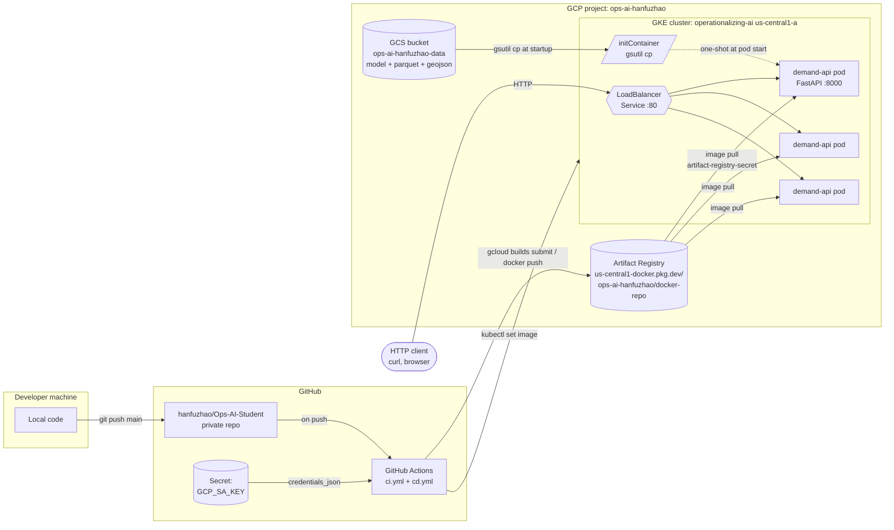

# Architecture

## Diagram (Mermaid — renders on GitHub)

## Flow in words

1. Code is pushed to `main` on the private GitHub repo.
2. `ci.yml` runs tests on the runner; `cd.yml` authenticates to GCP with the
   `GCP_SA_KEY` secret, builds the image, and pushes it to Artifact Registry
   as `demand-api:latest` and `demand-api:<git-sha>` (the SHA tag is the
   immutable artifact used for the rolling update and rollback).
3. CD then runs `kubectl set image deployment/demand-api …:<git-sha>` against
   the GKE cluster and waits for `rollout status` to confirm the new pods are
   healthy. The Deployment's `RollingUpdate` strategy (maxSurge 1,
   maxUnavailable 1) keeps service capacity during the swap.
4. Each pod has an init container that pulls the model and data files from
   GCS into a shared `emptyDir` volume mounted at `/data/processed/`; the
   `taxi_zones.geojson` is shipped inside the image at
   `/app/frontend/public/`. The main container then starts FastAPI/uvicorn on
   port 8000.
5. The Service of type `LoadBalancer` provisions a regional external IP and
   forwards port 80 to the pods' 8000. Clients hit that IP directly.

## What lives where

| Layer | Purpose | Key resource |
|---|---|---|
| Source | Code and manifests | GitHub repo `hanfuzhao/Ops-AI-Student` |
| Pipeline | Build, test, deploy | GitHub Actions `ci.yml` / `cd.yml` |
| Image registry | Stores tagged container images | Artifact Registry `docker-repo` (us-central1) |
| Object store | Model + data files | GCS bucket `ops-ai-hanfuzhao-data` |
| Compute | Runs pods | GKE cluster `operationalizing-ai` (us-central1-a, 2–5 n1-standard-2 nodes) |
| Workload | API process | Deployment `demand-api`, 3 replicas |
| Ingress | External entry | Service `demand-api` type LoadBalancer, port 80 → 8000 |
| Auth (CI→GCP) | Pipeline access | Service account `github-actions`, key in GitHub secret `GCP_SA_KEY` |
| Auth (GKE→AR) | Image pulls | k8s docker-registry secret `artifact-registry-secret` |
| Auth (GKE→GCS) | Init container data pull | Compute Engine default SA granted `storage.objectViewer` |
